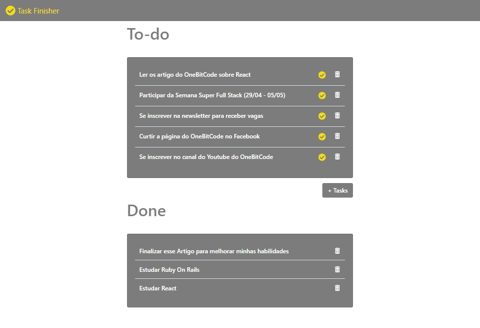

<h1 align="center">Rails Todo Tasks</h1>
  <p align="center">
  <strong align="center">Organize it all with Todoist</strong>
</p>
  
</p>

## Built With

- [Ruby on Rails](https://rubyonrails.org/)
- [React](https://reactjs.org/)

## How to use

```
$ git clone https://github.com/fdolzanes1/RailsTodoTasks/
```

### Backend

```
$ cd RailsTodoTasks
```
To get started with the app, clone the repo and then install the needed gems:
```
$ bundle install
```
Next, migrate the database:
```
$ rails db:migrate
```
You'll be ready to run the app in a local server:
```
$ rails server -p 3001
```
### FrontEnd

cd tasks_client

```
$ npm install 
```
```
$ npm start
```

## Software Developer

<table>
  <tr>
    <td align="center"><a href="https://github.com/fdolzanes1"><br /><sub><b>Fabiano Dolzanes</b></sub></a><br /><a href="https://github.com/fdolzanes1/RailsTodoTasks" title="Code">💻</a></td>
  <tr>
</table>
